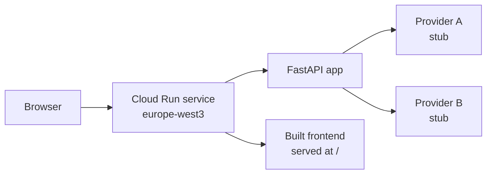

# Sinpex Hackathon 2026 — Federated Search Template

This is the starting point for your hackathon team. Use this template to create your own repo, build whatever you want, and deploy when you're ready.

The template is intentionally minimal — it compiles, runs, and ships a working "hello search" service. **How you build the search engine is up to you.** Swap providers, change the stack, add a database, rerank with an LLM, train a model — whatever you want.

---

## Get started

### 1. Create your team repo from this template

One person per team does this; everyone else joins as a collaborator.

1. Click **"Use this template" → "Create a new repository"** from this repo page.
2. **Owner:** `sinpexgmbh`
3. **Repository name:** must start with `team-` (e.g. `team-isar`, `team-bavarian-quokka`). This is a hard requirement — the deploy WIF allowlist is prefix-based, and a non-`team-*` name will fail with a 403.
4. **Visibility:** Private
5. Click **"Create repository"**
6. In your new repo, go to **Settings → Collaborators and teams → Add people** and invite your teammates with `Write` access.

You can rename the repo later as long as the prefix stays `team-`. You do **not** need a GCP account, gcloud, or any service-account files.

### 2. Clone and verify your toolchain

```bash
gh repo clone sinpexgmbh/team-<yourname>
cd team-<yourname>
make check
```

You should see green `OK` for docker / node / python / git. If anything is `FAIL`, see `docs/01-setup.md` for install links.

### 3. Run it locally

```bash
make dev
```

- App (frontend with hot reload): http://localhost:5173
- Backend API: http://localhost:8080/api/search?q=hello
- Health: http://localhost:8080/api/health

First `make dev` is slow (~2 min) while deps install inside the containers. Subsequent runs are fast.

Run backend tests:

```bash
make test    # requires `uv` on host: `brew install uv` or `pip install uv`
```

### 4. Deploy when you're ready

GitHub → **Actions** tab → **"Deploy to Cloud Run"** → **Run workflow**.

Deploy is **manual by default** — push to `main` does not auto-deploy. To enable push-to-deploy later, uncomment the `push:` trigger in `.github/workflows/deploy.yml`. See `docs/02-deployment.md` for the full deploy contract, secrets, and rollback.

---

## What you get

- **Backend**: FastAPI + Pydantic, with a `SearchProvider` interface and a parallel `FederatedSearch` orchestrator. Two stub providers wired in — replace them.
- **Frontend**: Vite + React + Tailwind. Minimal `SearchBar` wired to `/api/search`.
- **One container in prod**: Multi-stage `Dockerfile` builds the frontend, bundles it into the backend image, exposes port 8080. Cloud Run-native. (Local dev runs frontend + backend as two containers via `compose.yaml`.)
- **One workflow**: `.github/workflows/deploy.yml`. Trigger from the Actions tab.
- **Multi-container deploys**: drop a `compose.cloud.yaml` to add Redis/workers/etc. See `docs/04-compose.md`.

## Architecture (deployed)



## What's where

```
backend/
  app/
    main.py            FastAPI app, /api/health + /api/search
    config.py          pydantic-settings env config
    search/
      base.py          SearchProvider ABC + SearchResult model
      orchestrator.py  FederatedSearch — parallel fan-out + score merge
      providers/
        stub.py        Replace this with real providers
  tests/
    test_smoke.py      Health + search assertions
frontend/
  src/
    App.tsx, api.ts, components/SearchBar.tsx
Dockerfile             Multi-stage production image
compose.yaml           Local dev only — Cloud Run uses the Dockerfile
compose.cloud.yaml     (Optional) Multi-container deploys. See docs/04-compose.md
secrets.yaml           Declarative secret requests (empty by default)
.github/workflows/
  deploy.yml           Manual-trigger deploy via GitHub Actions + WIF
```

## Docs

- `docs/01-setup.md` — Prerequisites + first-run
- `docs/02-deployment.md` — How to deploy, secrets, rollback
- `docs/03-claude-code.md` — Tips for using Claude Code well during the hackathon
- `docs/04-compose.md` — Multi-container deploys (Redis sidecar, workers, etc.)
- `docs/faq.md` — Top failure modes + fixes

## Rules of engagement

1. **Deploy when ready.** Default trigger is manual — push without fear.
2. **Your service must listen on port 8080.** Cloud Run injects `PORT=8080`.
3. **Repo name must start with `team-`.** Org-level WIF policy. Renames are fine as long as the prefix stays.
4. **Need a secret (LLM key, DB URL, …)?** Add an entry to `secrets.yaml` and ping `#hackathon-help`. After the team populates the value, **re-trigger the deploy manually** (push-to-deploy is off by default).
5. **Demo-day cold-start matters?** Ask in `#hackathon-help` to set `min-instances=1` for your service before the demo hour.
